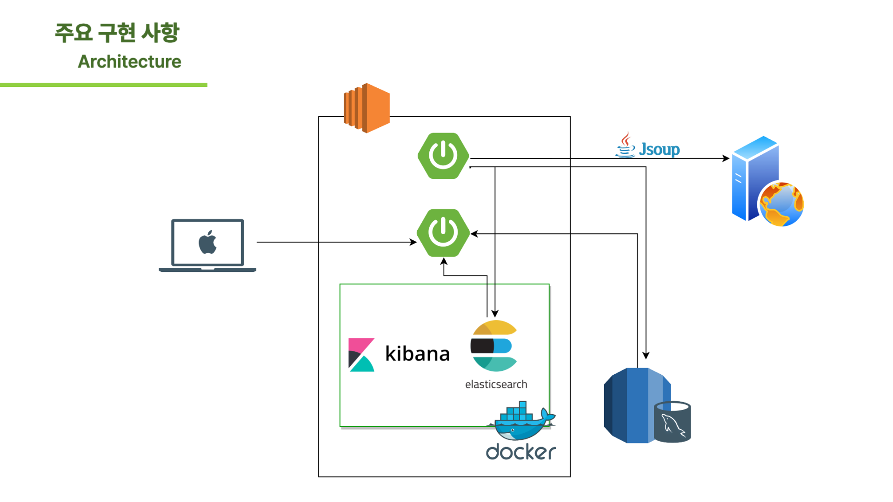

# E2E1-KernelEngine

필요한 자료를 검색해볼 수 있는 검색엔진

## 프로젝트 소개

가입한 유저의 블로그 게시글과 관리자가 등록한 기술 블로그의 게시글을 키워드를 통해서 검색할 수 있는 검색엔진 서비스, kernelEngine

### KernelEngine 기능 소개

**Basic User**

- 키워드를 통해 원하는 토픽이 들어간 게시글을 검색할 수 있다.
- 최근 많이 조회된 기술 블로그 리스트를 확인할 수 있다.

**Administer**

- 총 사용자 명수를 확인할 수 있다.
- 많이 검색된 키워드와 게시글을 확인할 수 있다.
- 블로그 리스트를 관리할 수 있다.

### 팀 소개

<table>
  <tbody>
    <tr>
      <td align="center">
        <a href="https://github.com/cgk95">
          
           <b>cgk95</b> 
        </a>
       </td>
             <td align="center">
        <a href="https://github.com/aacara">
          
           <b>aacara</b> 
        </a>
       </td>
      <td align="center">
        <a href="https://github.com/anso33">
          
           <b>anso33</b>
        </a>
         
       </td>
    </tr>
    <tr>
        <td align="center">
        <b>REST API  Batch Module   서버 배포</b>
        </td>
        <td align="center">
        <b>REST API  Spring Security  Search API</b>
        </td>
        <td align="center">
        <b>REST API  Crawler</b>
        </td>
    </tr>
  </tbody>
</table>

### 기술 스택

#### Backend

#### Frontend

#### DB

#### Others

### ERD

## 진행 상황

확인하기

매주 2회 정도 스프린트 회의를 통해 전체적인 프로젝트의 진행상황 확인 중 매일 아침 스크럼을 통해 오늘 할일을 정리하고 목표 설정

정기적인 팀회고를 통해서 프로젝트 진행상황을 확인하고 개선할 점을 찾아내는 중

### 크롤링 -> RSS parser (70%)

**현재 어느정도 일반화되어 있는 rss 페이지를 기반으로 크롤링완료**

**주기적으로 크롤링할 수 있도록 구현**

- 그럼에도 생기는 일반화되지 않은 태그에 대해서 어떻게 에러처리할 것인지 고민 중

### 검색 엔진 (30%)

**mysql을 기반으로한 검색 api 구현 완료**

- 차후 elastic search를 사용한 검색 api로 변경할 예정

### 관리자 페이지 (50%)

**관리자의 기능인 블로그 관리 구현 완료**

**관리자의 기능인 일자별 회원가입한 유저 차트 구현 완료**

- 가장 많이 조회한 블로그 랭킹 구현 예정

- 가장 많이 조회한 게시글 랭킹 구현 예정

### 로깅 (60%)

**run profile에 따라 로그를 출력하는 방식을 다르게 구현 완료**

- dev profile : console에 로그를 출력
- prod profile : file에 로그를 출력

- 로그를 보기 쉽도록 색깔 입힐 예정

### 유저 계정 관리 (80%)

**jwt 기반 로그인 구현 완료**

**회원 탈퇴 구현 완료**

- admin 으로 회원가입하는 로직이 아직 불완전

- 리팩토링 필요

---

### 1주차 TODO

- [X] 크롤링 해온 blog 게시글 DB에 저장 (CRUD)
- [X] 블로그 리스트 관리 CRUD
- [X] mysql 기반 검색 API 구현
- [X] simple rss parser 구현

### 2주차 TODO

- [X] rss parser develop
- [X] DataLoader로 애플리케이션 시작할 때 데이터 끌어오기
- [X] 피드를 누르면 게시글 원본으로 리다이렉트 시키기
- [X] 서비스 메인페이지에 게시글 피드 최신순으로 보이게 하기 (프-백)
- [ ] 블로그 주소 리스트 조회

- User (프-백)
    - [X] 회원가입
    - [ ] 회원 정보 수정
    - [ ] 자신의 Blog Url 등록

### 3주차 TODO

- [X] logger 달기

- 관리자 페이지
    - [x] 총 사용자 명수 통계
    - [x] 블로그 리스트 관리 항목 프론트 페이지에 정리(정렬?)하기

- User
    - [x] 회원 탈퇴

- 크롤링
    - [x] spring batch 적용하기

### 4주차 TODO

- [X] 관리자 페이지
    - [x] 일별 가입한 사용자 수 통계에 spring batch 적용하기 -> spring batch 적용 완료
    - [x] 많이 접속된 게시글 통계 -> spring batch 적용 완료

- [x] 검색 기능
    - [x] mysql 기반 API
        - [x] 조회순, 최신순 필터 적용하기
    - [x] elastic search 기반 API 만들기

        - elastic search에 feed data를 어떻게 저장해야 원하는 검색 결과를 얻을 수 있을지 학습 중
        - [x] 필터 적용까지

- [x] 가장 간단한 아키텍처 구조로 AWS에 서버 띄우기
    - 멀티 모듈을 돌리는 것 + 사소한 설정(jar 파일 관리)에서 생긴 문제를 해결 중 차안으로 db와 application server를 docker container로 올리고 docker network로
      연결하여 한번에 EC2로 올리는 방안을 고려 중

### 5주차 TODO

- [X] elastic search 기반 검색 API와 mysql 기반 search API 성능 비교하기 1. elastic search 2. mysql 의 like 3. mysql 의 n-gram 기반의
  Full-Text 검색

- [ ] 아키텍처 구조 리팩터링하기
    - 더 빠른 검색을 위한 엘라스틱 서치 아키텍처 구조
    - 멀티 모듈 분리하기
    - 장애를 대비할 수 있는 아키텍처 구조 고민해보기
- [ ] 코드 리팩터링 -> `in progress`

## Architecture

##                          

