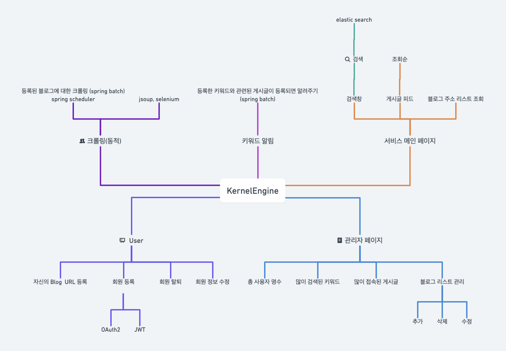
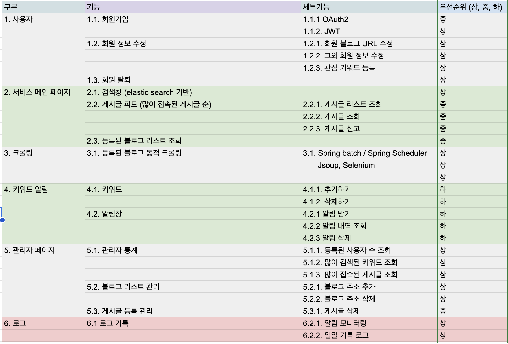
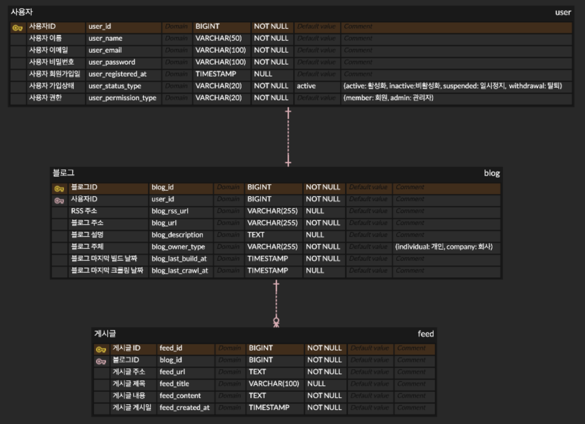

# E2E1-KernelEngine

필요한 자료를 검색해볼 수 있는 검색엔진

## 프로젝트 소개

가입한 유저의 블로그 게시글과 관리자가 등록한 기술 블로그의 게시글을 키워드를 통해서 검색할 수 있는 검색엔진 서비스, kernelEngine

### KernelEngine 기능 소개

**Basic User**

- 키워드를 통해 원하는 토픽이 들어간 게시글을 검색할 수 있다.
- 최근 많이 조회된 기술 블로그 리스트를 확인할 수 있다.

**Administer**

- 총 사용자 명수를 확인할 수 있다.
- 많이 검색된 키워드와 게시글을 확인할 수 있다.
- 블로그 리스트를 관리할 수 있다.

### 기술 스택

- Backend
    - java 11
    - springboot 2.7.17
- Frontend
    - css
    - html
    - thymeleaf
- DB
    - mysql
    - elastic search

### ERD

## 진행 상황

매주 2회 정도 스프린트 회의를 통해 전체적인 프로젝트의 진행상황 확인 중 매일 아침 스크럼을 통해 오늘 할일을 정리하고 목표 설정

### 크롤링 (20%)

**사용자의 블로그마다 다른 html 요소를 어떻게 크롤링할 것인지에 대한 문제를 고민 중**

현재 어느정도 일반화되어 있는 rss 페이지를 기반으로 크롤링완료하여 서버를 running 할 때마다 한번씩 크롤링하도록 구현하였으나 차후 주기적으로 크롤링할 수 있도록 변경할 예정

### 검색 엔진 (30%)

**mysql을 기반으로한 검색 api 구현 완료**

차후 elastic search를 사용한 검색 api로 변경할 예정

### 관리자 페이지 & 로깅 (10%)

관리자의 기능인 블로그 관리 CRUD 백엔드 기능 구현 완료

